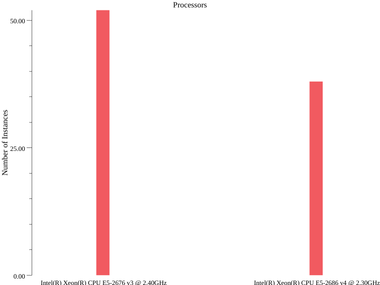
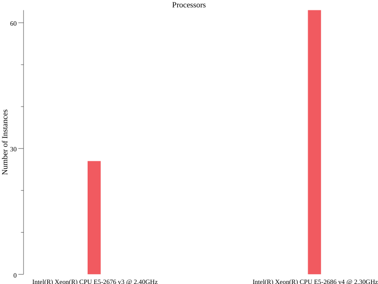
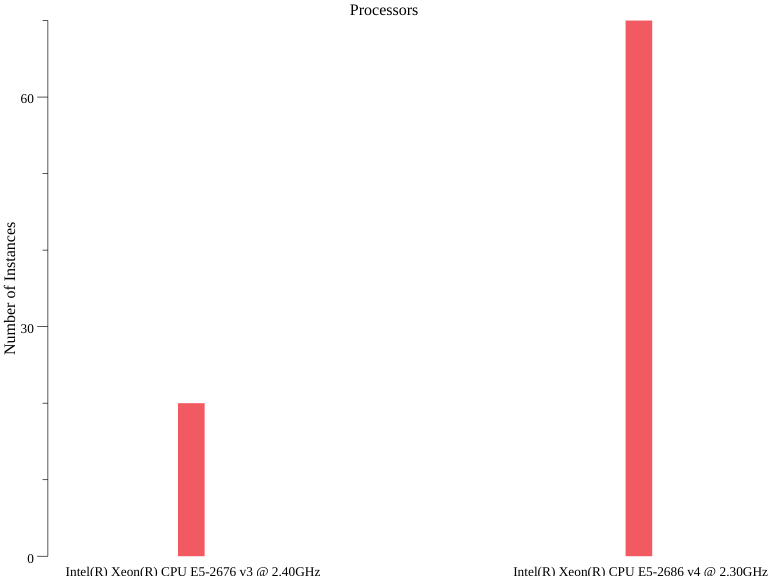
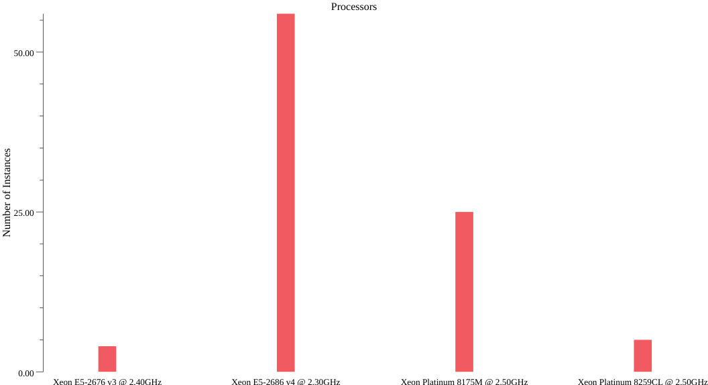

# EKS Fargate Processor Info

This folder contains a very crude benchmark test you can run against EKS Fargate to get some insight into the underlying
hardware used for Fargate.

## Motivation

AWS Fargate is a serverless platform that allows you to schedule EKS Pods and ECS Tasks without explicitly managing
worker nodes. However, because you do not manage the worker nodes, this means that you are relying entirely on AWS to
configure the hardware for running your tasks.

Since you can not configure or provision the hardware, you only have limited control over the hardware that you
ultimately get. Specifically, you can only choose how many vCPUs and how much Memory is allocated to your instance. You
do not get to choose the instance class or EBS volumes. AWS doesn't publish this information, but we can deduce it
through empirical investigation.

The goal of the test in this folder is to get some insight into the underlying hardware provisioned with Fargate.

## Approach

This test implements a very simple benchmark, where we schedule N pods on EKS Fargate that collects information about
the CPU. Each Pod will run a standard json parsing benchmark ([citm_catalog.json from the
nativejson-benchmark](https://github.com/miloyip/nativejson-benchmark)) and record runtimes alongside the CPU that it
sees.

We can then count the various CPU models that we encounter to guess what instance class make up the Fargate fleet. Note
that the benchmark is not strictly necessary, but is useful for comparing how various hardware might perform across
generations.

## Result

**us-east-1**

**us-east-2**

**eu-west-1**

**ap-northeast-1**

From the results, the four processors that we encounter in all regions are:

- Intel(R) Xeon(R) Platinum 8259CL CPU @ 2.50GHz
- Intel(R) Xeon(R) Platinum 8175M CPU @ 2.50GHz
- Intel(R) Xeon(R) CPU E5-2686 v4 @ 2.30GHz
- Intel(R) Xeon(R) CPU E5-2676 v3 @ 2.40GHz

The processors are a mix of m4 instance class family (E5-2686 and E5-2676) and t3 instance class family (Platinum 8259CL
and Platinum 8175M), so we can guess that the Fargate fleet consists of these instance classes.

## Usage

Run `go test -timeout 4h .`
