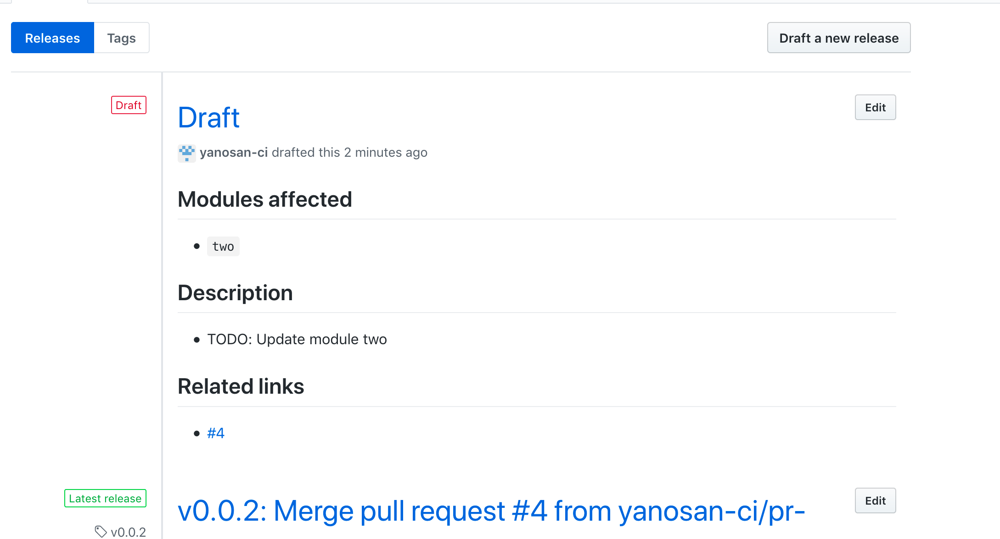
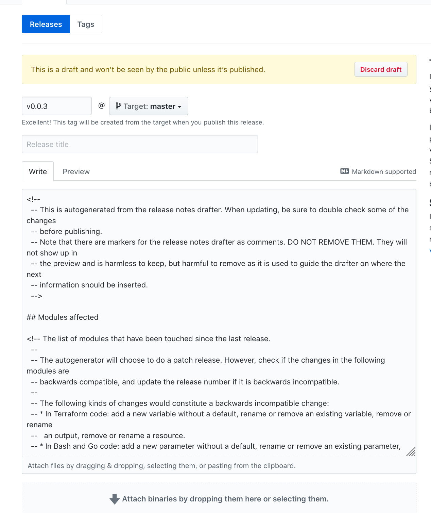

# Release notes drafter

This provides a Golang based event handler that will react to pull request merge hook events from Github to maintain a
release notes draft on the repo.

This can be used as:

- A standalone webserver
- An AWS lambda function
- A Github Action

The draft is based on the Gruntwork release notes style guide. Specifically, it maintains the following structure:

```
## Modules Affected

<!-- Contains the list of modules that have been affected by this change -->

## Description

<!-- Contains a description of the change. The drafter will add an entry for each pull request that is a placeholder
  -- TODO, containing the PR title.
  -->

## References

<!-- Contains a list of links to the PRs -->
```

## Example

The first draft will look something like this:



Notice how all the comments (e.g the markers) are not shown in the preview. These are still available when you try to
edit the release note:




## How it works

This depends on the webhook event from github when a pull request merges. For each PR merge, the handler will:

- Scan the PR diff for the list of modules that have been touched in the changeset.
- Extract a link to the PR.
- Get the latest release for the repo and check if it is in draft stage.
- If there is a draft, read in the current notes. If not, create a new note based on the template.
- Update the draft with the information by looking for specific markers.
- Upsert the draft to github.

Note that this handler requires synchronization to avoid concurrency issues in updating the draft. We use dynamodb for
this purpose.


## How to deploy

### Github Action

- Build a copy of the command:
    - `GOOS=linux go build -a -o release-notes-drafter .`

- Copy the contents of [`sample_github_action`](./sample_github_action) to the repo:
    - `main.workflow` should go into the repo's `.github` folder.
    - `Dockerfile` should go into a new folder called `release_notes_drafter`.

- Copy the build binary into the repo, under the folder `release_notes_drafter`


### Lambda

<!-- TODO: see if github has static ips we can use for ip whitelisting -->

- Build and deploy as a public lambda object with an API gateway, making sure to run the command with the `lambda` arg.
- Set the runtime environment variables:
    * `GITHUB_WEBHOOK_SECRET`: Github Webhook secret. This should be generated.
    * `GITHUB_TOKEN`: Github API key with scope `repo`. This should be for a user with enough permissions to update
      the release notes on the repo (Read/Write access).
    * AWS IAM profile with DynamoDB access to a lock table. Used for synchronization.

- Setup a webhook for each repo that we want the release notes drafter to handle. The webhook should point to the API
  gateway endpoint and the secret key should be the one set in the runtime environment for the lambda function.


### Local

- Set the runtime environment variables:
    * `GITHUB_WEBHOOK_SECRET`: Github Webhook secret. This should be generated.
    * `GITHUB_TOKEN`: Github API key with scope `repo`. This should be for a user with enough permissions to update
      the release notes on the repo (Read/Write access).
- Build and run the app with `local` arg.
- This will run a web server on port 8080
- Start [`ngrok`](https://ngrok.com/) to expose the app
- Setup github repo with webhook to point to the ngrok endpoint
